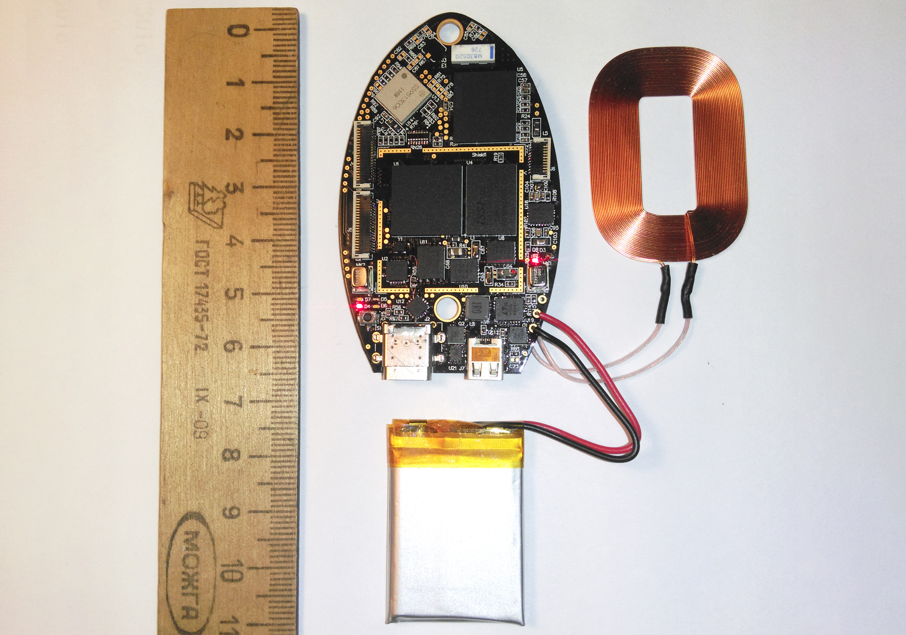
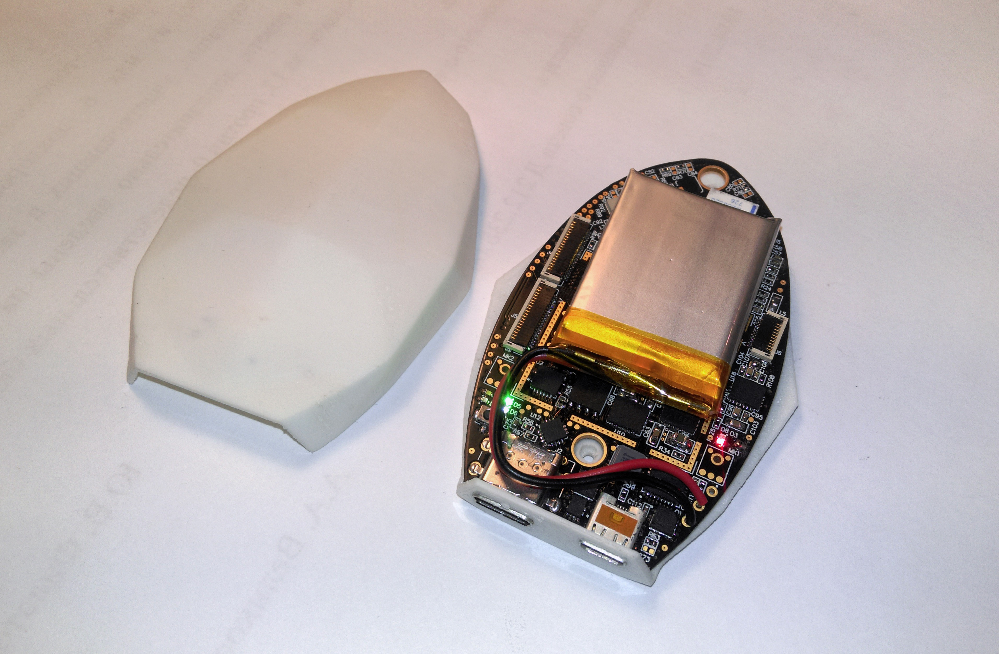
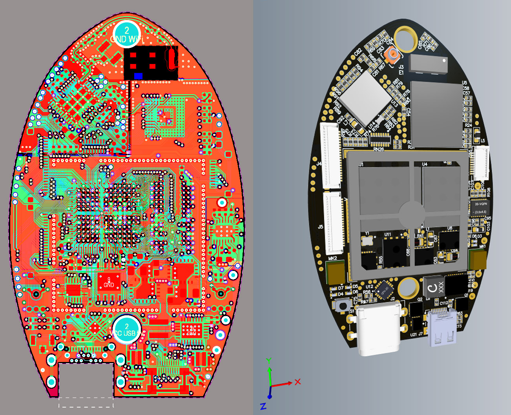

### NNLightSwitcher - Xilinx Zynq board

The project serves educational purposes, therefore, the maximum number of modules that fit on a small board was used.

Main components on the board:
- Main processing unit: Zynq-7000 SoC (Z-7010) in CLG225 package (FPGA and two ARM Cortex-A9 cores running at 666 MHz)
- Memory: DDR3L 1066 MHz 512 Mb (IS43TR16256AL-125KBL)
- eMMC 8 Gb (MTFC8GAKAJCN-1M WT)
- QSPI Configuration memory (W25Q32JVZPIQ)
- Qi, WPC 1.1 wireless charger 5W (BQ51013BRHLT)
- Battery powering and charging unit (LTC4155EUFD)
- WiFi WLAN(11a/b/g/n/ac) dual band 2.4/5Ghz +BT/BLE(BT5.0) combo SIP module Murata Type1MW with Cypress CYW43455 with chip antenna
- Connectors: USB Type-C (UART), HDMI
- Two MEMS microphones (ICS-40300)

**Hardware** folder includes Altium Designer project for the PCB and schematic.
- Board dimensions: 68 x 42 mm
- Board layers: 6
- Minimum hole: 0.2 mm
- Minimum trace width/gap: 0.1/0.1 mm
- Immersion gold plating (ENIG) is used to ensure surface quality for the BGA chips.

**Enclosure** folder includes STL models for the 3D printed enclosure (made in Blender).

**Software** is in progress. 

